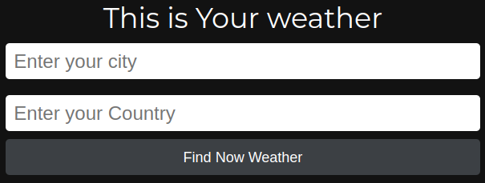
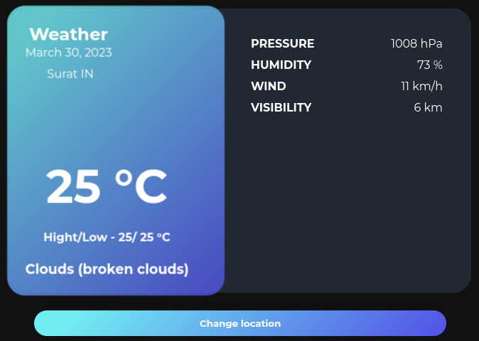

<h1>How to develop a weather application in React JS</h1>

As a Frontend Developer you'll work with data on daily basis, API calls, structuring data models, data transformation to fit in the UI. Weather App is a perfect project to practice all the above skills and additionally - craft a beautiful UI. If you use Vanilla JS for it, you'll also learn a bit of DOM manipulation.
